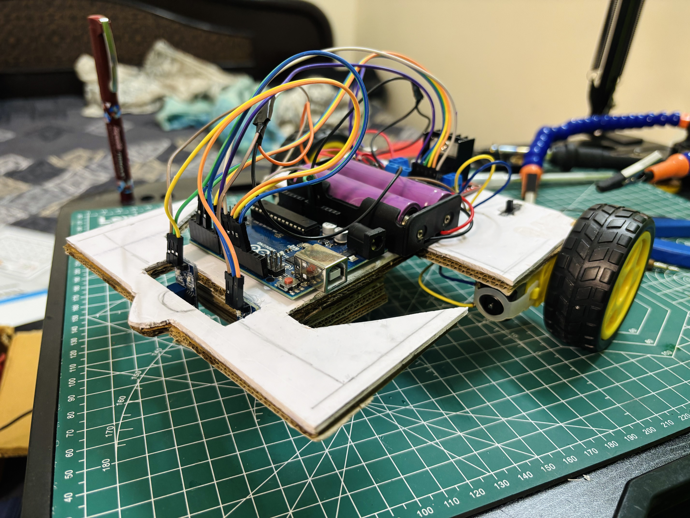

<div align="center">


</div>

<div align="center">


**autonomous robot that follows a black line using IR sensors.**  
*built from scratch. no kit. no tutorial. just components, a multimeter, and trial & error.*

</div>

---

## 📸 demo

<div align="center">

</div>

---

## ⚙️ components

<div align="center">

| component | qty | role |
|:---|:---:|:---|
| Arduino UNO | 1 | brain — reads sensors, controls motors |
| L298N Motor Driver | 1 | drives both motors, controls speed & direction |
| IR Sensor Module | 2 | detects black line vs white surface |
| TT Gear Motor | 2 | left and right drive wheels |
| Rubber Wheel | 2 | traction |
| Caster Wheel | 1 | front support, reduces friction |
| Buck Converter | 1 | steps battery voltage down to stable ~5V |
| Li-ion Battery (18650) | 2 | power source (~7.4V in series) |
| Battery Holder | 1 | holds both cells |
| Switch | 1 | main power on/off |

</div>

---

## 🔌 circuit

```
[ 2x Li-ion ]
      ↓
  [ Switch ]
      ↓
[ L298N 12V IN ] ──────── powers motors directly
      ↓
[ Buck Converter ] ─────── steps down to ~5V
    ↙    ↓    ↘
[Arduino] [Left IR] [Right IR]

all grounds → L298N GND (common ground)

right motor → OUT1, OUT2  (IN1, IN2, ENA pin 9)
left  motor → OUT3, OUT4  (IN3, IN4, ENB pin 10)
```

> ⚠️ the L298N's onboard 5V regulator was damaged — outputting ~2V instead of 5V. diagnosed with a multimeter. fixed by removing the `5V EN` jumper and using an external buck converter instead.

---

## 💡 how it works

<div align="center">

| left IR | right IR | means | action |
|:---:|:---:|:---|:---|
| LOW | LOW | centred on track | move forward |
| HIGH | LOW | drifted right | turn left |
| LOW | HIGH | drifted left | turn right |
| HIGH | HIGH | line lost | stop |

</div>

`LOW` = white surface (IR reflected back)  
`HIGH` = black surface (IR absorbed)

turning uses **differential speed** — both motors stay forward, outer wheel faster, inner wheel slower. smooth curve instead of a harsh pivot.

---

## 💻 code

```cpp
#include <Arduino.h>

int in1 = 2, in2 = 4;        // right motor direction
int in3 = 7, in4 = 8;        // left motor direction
int enA = 9,  enB = 10;      // speed (PWM)
int left_IR  = 11;            // ⚠️ not pin 13 — built-in LED causes false reads
int right_IR = 12;
int motorSpeed = 77;

void setup() {
  Serial.begin(9600);
  pinMode(enA, OUTPUT); pinMode(enB, OUTPUT);
  pinMode(in1, OUTPUT); pinMode(in2, OUTPUT);
  pinMode(in3, OUTPUT); pinMode(in4, OUTPUT);
  pinMode(left_IR, INPUT); pinMode(right_IR, INPUT);
}

void loop() {
  int L = digitalRead(left_IR);
  int R = digitalRead(right_IR);
  Serial.print("L:"); Serial.print(L);
  Serial.print(" R:"); Serial.println(R);

  if      (L==LOW  && R==LOW)  moveForward();
  else if (L==HIGH && R==LOW)  moveLeft();
  else if (L==LOW  && R==HIGH) moveRight();
  else                         stop();
}

void moveForward() {
  analogWrite(enA, motorSpeed); analogWrite(enB, motorSpeed);
  digitalWrite(in1,HIGH); digitalWrite(in2,LOW);
  digitalWrite(in3,HIGH); digitalWrite(in4,LOW);
}
void moveLeft() {
  analogWrite(enA, motorSpeed); analogWrite(enB, motorSpeed);
  digitalWrite(in1,HIGH); digitalWrite(in2,LOW);
  digitalWrite(in3,LOW);  digitalWrite(in4,HIGH);
}
void moveRight() {
  analogWrite(enA, motorSpeed); analogWrite(enB, motorSpeed);
  digitalWrite(in1,LOW);  digitalWrite(in2,HIGH);
  digitalWrite(in3,HIGH); digitalWrite(in4,LOW);
}
void stop() {
  analogWrite(enA, 0); analogWrite(enB, 0);
  digitalWrite(in1,LOW); digitalWrite(in2,LOW);
  digitalWrite(in3,LOW); digitalWrite(in4,LOW);
}
```

full file → [`src/line_follower.ino`](src/line_follower.ino)

---

## 🪲 real problems i ran into

**🔴 L298N 5V rail dead**  
motors weren't moving. traced voltage rail by rail with a multimeter. battery fine. motor driver input fine. but the onboard 5V pin was outputting ~2V — regulator was fried. removed the `5V EN` jumper, wired external buck converter. fixed.

**🔴 motors stuck at full speed**  
ENA/ENB jumpers were shorting enable pins directly to 5V — no PWM possible. removed jumpers, connected ENA/ENB to arduino PWM pins 9 & 10. speed now fully controllable in code.

**🔴 robot flying off the track**  
original pivot turn logic was too aggressive. switched to differential speed — both motors forward, just different speeds. tracking became smooth.

**🟡 losing line on cream tiles**  
IR sensors struggle with low contrast. black electrical tape on cream tiles = unreliable. still testing. white surface + black tape works better.

---

## 🔮 next

- [ ] PID control for smoother tracking
- [ ] 3–5 sensors for better curves
- [ ] obstacle avoidance (ultrasonic)
- [ ] line-lost recovery routine

---

## 🧠 what i actually learned

- IR sensors, motor drivers, PWM — how they really work
- hardware debugging with a multimeter (not just googling errors)
- why common ground is non-negotiable
- differential speed vs pivot turns
- 90% of hardware bugs are power issues or a loose wire

---

<div align="center">

**[Mohit Sarraf](https://github.com/mohitsarraf9198)** · project #1 of many


</div>
